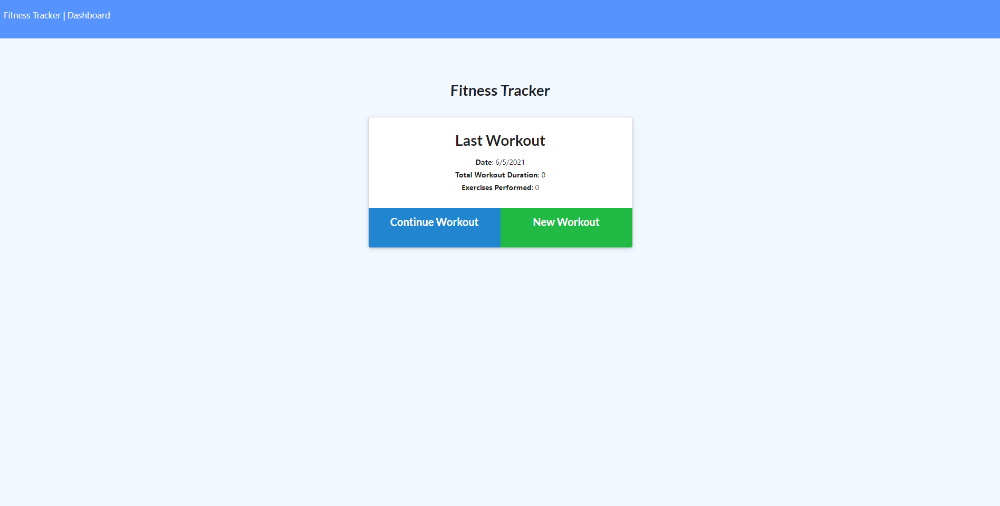
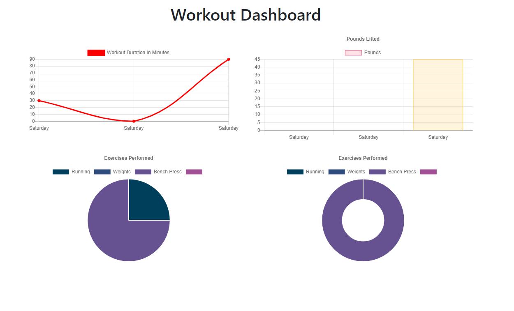

# fitness-tracker

 

## Description

Heroku and MongoAtlas deployed app that uses mongodb and mongoose. Keep up with your workout plans and exercises and check progress on the dashboard to reach your fitness goals. Go to the [live site](https://tranquil-waters-83609.herokuapp.com/) or follow the steps to see how to use.

## How To

- Go to [live site](https://tranquil-waters-83609.herokuapp.com/)
- Click on new workout
- In the form, fill in fields
- Add exercise and complete when done
- To see last 7 days of progress, go to the Dashboard in the navigation bar

### Important Links

- [Live site](https://tranquil-waters-83609.herokuapp.com/)

### Images

### License

MIT License
